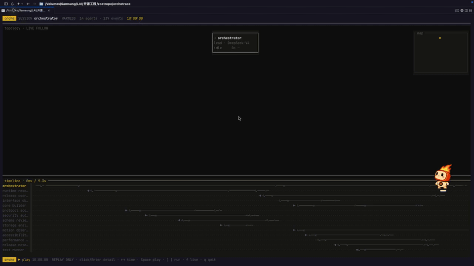
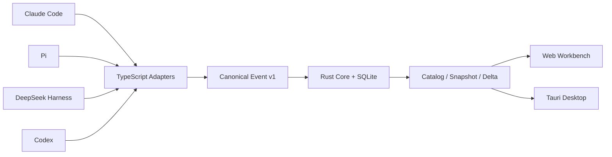

# Orchetrace

[](https://github.com/wang-zhengxin/orchetrace/actions/workflows/ci.yml)
[](LICENSE)

Orchetrace 是一个本地优先的多 Agent 可观测工作台，统一展示 Claude Code、Codex、Pi 和 DeepSeek Harness 的会话、父子 Agent 拓扑、工具调用、状态证据与执行时间线。

它不是 Agent 编排器，也不替代各运行时自己的交互界面。Orchetrace 只观察运行时已经产生的事实，并将它们转换为一致、可回放的诊断视图。

> 当前状态：`0.1.0-alpha`。核心链路已经可运行，适合本地试用和 Adapter 开发；安装包、数据保留策略和多版本兼容仍在加固中。

## 终端回放演示



动画取自 14-Agent 实际 TUI 回放的 8 个关键帧：节点按真实时间逐步出现，拓扑缩略图与多行时间泳道同步更新，并展示根 Agent 详情、完整拓扑、失败节点证据及节点侧栏详情。

## 核心能力

- Claude Code、Codex、Pi、DeepSeek Harness 统一接入，并允许未知 Runtime 以注册描述符扩展；
- 根 Agent、子 Agent 和嵌套子 Agent 拓扑；
- Replay 与 Live 两种观察模式；
- Agent 状态、activation、工具调用、错误和终态证据；
- 多 Run Catalog、搜索、状态过滤、Inspector 和 Timeline；
- Rust 确定性 fold、SQLite 事实存储、checkpoint 快速恢复、增量快照和 delta；
- 超过 1,000 条的 timeline 自动分页，首屏读取真实时间概览，历史回放与详情按需补齐；
- WebSocket 实时通知，断开后自动降级为轮询；
- Tauri 桌面壳、受管 `otrace` sidecar、四运行时自动发现和结构化诊断抽屉；
- Adapter 健康度聚合、可定位的 severity/code/location 失败证据，以及四运行时共享的生命周期契约测试；
- SQLite 事实体检、派生投影安全修复、按 Run 导出和不含会话正文的诊断包；
- 直接嵌入当前终端的 `orche` TUI，支持拓扑、真实时间回放、多 Agent 时间泳道和侧边详情；
- token 认证、loopback-only 监听和认证后的优雅退出。

## 运行时支持

| 运行时 | Replay | Live | 子 Agent |
|---|---|---|---|
| DeepSeek Harness | Zstandard persistence | 被动自动发现 + Cordis Observer | 原生 session 与 descriptor |
| Claude Code | JSONL transcript | 自动发现 + 增量 polling observer | subagent 与 workflow 文件 |
| Pi | v1-v3 session JSONL | 被动自动发现 + 可选 RPC bridge | 显式 telemetry extension |
| Codex | rollout JSONL | 递归自动发现 + ACK 后提交字节游标 | 原生 `thread_spawn.parent_thread_id` |

Pi 的普通对话分支不会被误判为子 Agent。只有 extension 提供显式 telemetry 时，Orchetrace 才展示 Pi 子 Agent 拓扑。

## 工作方式



统一协议只保存运行时能够证明的事实。`idle`、文件静默或普通工具名称不会被推断为 `done` 或子 Agent。

## 环境要求

- Rust 1.88 或更新版本；
- Node.js 22 或更新版本；
- `zstd` 命令（DeepSeek Harness 多帧 persistence 被动监听）；
- macOS、Linux 或 Windows；
- 启动桌面壳时需要本机已安装 [Tauri 2 对应的系统依赖](https://v2.tauri.app/start/prerequisites/)。

仓库中的 TypeScript 直接使用 Node.js type stripping 运行，不需要额外 bundler。

## 快速开始

生成包含 14 个 Agent、13 条父子边和 139 个事件的演示数据，并启动 Web 工作台：

```bash
npm run fixture:demo

cargo run -q -p orchetrace-cli --bin otrace -- \
  fold fixtures/dsh/demo-canonical-events.jsonl \
  --data-dir apps/web/public/data

npm run dev:web
```

然后访问 <http://127.0.0.1:4173>。

## 直接在终端中打开

无需浏览器或 Tauri 窗口，可以直接在当前终端启动全屏观察界面：

```bash
npm run tui
```

安装为全局命令后，可以在任意目录直接执行 `orche`：

```bash
cargo install --path crates/cli --bins
orche
```

`orche` 默认会启动本机 Ingest，并被动观察当前及后续打开的 Claude Code、Codex、Pi 和 DeepSeek Harness 会话；无需另外启动桌面端或 watcher。它会依次检查 `ORCHETRACE_DATA_DIR`、桌面应用数据目录以及当前工程的 `apps/web/public/data`。也可以显式指定：

```bash
orche --data-dir /path/to/orchetrace/data
```

节点支持鼠标单击，点击后从右侧打开真实 prompt、reasoning、message、tool 与 outcome 详情；右上角 `map` 是随历史时间游标同步变化的拓扑缩略图，底部时间轴也可以直接点击定位。仅查看已有快照、不启动观察器时使用 `orche --replay`。

受控环境可使用默认 `standard` 模式，它保留摘要和工具证据，但会递归遮蔽常见 token、password、authorization、cookie、private key 等字段。敏感环境建议只记录运行元数据，并设置自动保留边界：

```bash
export ORCHETRACE_PRIVACY_MODE=metadata-only
export ORCHETRACE_REDACT_KEYS=customer_id,workspace_id
export ORCHETRACE_RETENTION_DAYS=30
export ORCHETRACE_MAX_EVENTS=100000
orche
```

`metadata-only` 仍保留 Agent 拓扑、状态、模型、工具名称、耗时和终态，但将 prompt、message、reasoning、arguments、路径与证据正文替换为 `[OMITTED]`。`ORCHETRACE_REDACT_KEYS` 接受逗号分隔的自定义字段名。

主要快捷键：

- `↑` / `↓` 或 `j` / `k`：选择 Agent；
- `Enter`：打开或关闭右侧详情；
- `←` / `→` 或 `h` / `l`：移动真实时间游标；
- `Space`：以真实时间 1× 播放或暂停；
- `[` / `]`：切换 Run；
- `f`：恢复跟随最新状态；
- `q`：退出并返回原终端。

## 启动本地 Live 服务

```bash
export ORCHETRACE_TOKEN="$(openssl rand -hex 32)"

cargo run -q -p orchetrace-cli --bin otrace -- \
  serve \
  --listen 127.0.0.1:43117 \
  --live-listen 127.0.0.1:43118 \
  --web-origin http://127.0.0.1:4173 \
  --db .orchetrace/orchetrace.db \
  --data-dir apps/web/public/data \
  --privacy-mode standard \
  --retention-days 30 \
  --max-events 100000

npm run dev:web
```

Ingest 和 Live 端口只允许绑定 loopback 地址。Adapter 必须在首帧提供正确 token，WebSocket 还会校验 Origin。

## 接入 Claude Code

Replay 一个 Claude transcript：

```bash
npm run claude:map -- /path/to/session.jsonl \
  --source-id my-workspace \
  --output /tmp/claude-events.jsonl

cargo run -q -p orchetrace-cli --bin otrace -- \
  fold /tmp/claude-events.jsonl \
  --data-dir /tmp/orchetrace-claude
```

在 `otrace serve` 已运行且使用相同 token 时，可以自动发现当前和新打开的 Claude 会话：

```bash
npm run claude:auto
```

自动发现器监听 `~/.claude/projects`，为最近活跃的每条根 transcript 创建独立 Observer，并自动跟踪其 `subagents` 和 `workflows`。已经打开的旧终端可通过一次性 Claude Hook 集成在下一次 prompt 或子 Agent 生命周期事件时精确接管：

```bash
npm run claude:hook -- install
```

Hook 只登记 `session_id`、`transcript_path`、`cwd` 和子 Agent 身份，不保存 prompt 或回答正文。可用 `status` 检查、用 `uninstall` 完整移除 Orchetrace 管理的 Hook，其他 Claude 设置保持不变。

只监听指定 transcript 时仍可使用：

```bash
npm run claude:live -- /path/to/session.jsonl \
  --source-id my-workspace \
  --state .orchetrace/claude.cursor.json
```

Adapter 会自动发现相邻的 `subagents` 和 `workflows`，并在 Rust ACK 后才提交读取 cursor。

Tauri 桌面端启动受管 Ingest 时会同时启动 Claude 自动发现器；Runtime Diagnostics 中可以独立启停 watcher，并一键启用或移除生命周期 Hooks。
桌面端默认在启动时自动拉起 Ingest 和 watcher；需要纯 Replay 模式时可设置 `ORCHETRACE_AUTOSTART=0`。

## 接入 Pi

监听当前已经打开以及随后新建的 Pi 会话：

```bash
export ORCHETRACE_TOKEN="<与 otrace serve 相同的 token>"
npm run pi:auto
```

自动发现器递归监听 `~/.pi/agent/sessions` 中最近 6 小时活跃的 JSONL，会话事件在 Rust ACK 后才提交本地 cursor。它只读取 Pi 已经写入的文件，不会启动、恢复或控制另一个 Pi 进程；如需导入全部历史，可追加 `-- --include-existing`。

Replay 一个 Pi session：

```bash
npm run pi:map -- /path/to/pi-session.jsonl \
  --source-id my-workspace \
  --output /tmp/pi-events.jsonl
```

启动受管 RPC Live Bridge：

```bash
npm run pi:live -- /path/to/pi-session.jsonl \
  --source-id my-workspace \
  --state .orchetrace/pi.live.json \
  --forward-stdin
```

如需展示 extension 创建的子 Agent，加载显式 telemetry contract：

```bash
npm run pi:live -- /path/to/pi-session.jsonl \
  --pi-extension ./packages/pi-telemetry-extension/src/index.ts
```

默认 RPC 命令为 `pi --mode rpc --session <path>`。

Tauri 桌面端会随受管 Ingest 自动启动 Pi 被动 watcher，也可在 Runtime Diagnostics 中独立启停。RPC Bridge 仍保留给需要完整 RPC 生命周期或由 Orchetrace 主动托管 Pi 的场景。

## 接入 Codex

监听 Codex CLI、Desktop 或编辑器已经写入的当前会话：

```bash
export ORCHETRACE_TOKEN="<与 otrace serve 相同的 token>"
npm run codex:auto
```

自动发现器递归监听 `~/.codex/sessions/**/rollout-*.jsonl` 中最近 6 小时活跃的会话。它按字节增量读取，只在 Rust Ingest 确认事件后提交 `0600` cursor；因此不会启动、恢复或控制 Codex，也不会在每次轮询时重读完整 rollout。`-- --include-existing` 可导入全部历史。

Codex `session_meta` 中的 `thread_spawn.parent_thread_id`、`depth`、Agent 昵称和角色会映射为真实父子拓扑；task、message、reasoning、exec、Patch、MCP 和 Web Search 事件会进入同一条真实时间轴。Tauri 和终端 `orche` 会随受管 Ingest 自动启动该 watcher，也可以设置 `ORCHETRACE_CODEX_SESSIONS_DIR` 覆盖默认目录。

Runtime 协议对 `codex` 有内置描述符，同时允许 Adapter 发送其他非空 Runtime 标识；未知 Runtime 会使用安全的中性色和自动生成标签显示，不再要求 Rust Core 发版才能存储与回放。

## 接入 DeepSeek Harness

无需修改 Harness 配置即可监听当前和新会话：

```bash
export ORCHETRACE_TOKEN="<与 otrace serve 相同的 token>"
npm run dsh:auto
```

被动 watcher 监听 `~/.dsh/sessions/**/session.jsonl.zstd`，解码 Harness 的多帧 Zstandard persistence，并以 `dsh-local + session id + seq` 生成稳定事件 ID。默认接管最近 6 小时活跃会话；`-- --include-existing` 可导入全部历史。Tauri 桌面端会自动托管这一 watcher。

若需要比 persistence 落盘更早的 Agent status/disposed 事件，可同时启用进程内 Cordis Observer。两条通道使用相同默认 `sourceId=dsh-local`，Rust 会按事件 ID 幂等去重：

在 Harness 插件配置中加载 `@orchetrace/dsh-observer`，并让 Observer 与 `otrace serve` 使用同一个 token：

```yaml
- name: "@orchetrace/dsh-observer"
  config:
    host: 127.0.0.1
    port: 43117
    sourceId: dsh-local
```

token 可以通过插件的 `config.token` 提供，也可以从 `ORCHETRACE_TOKEN` 环境变量读取。Observer 会组合实时事件与可用的冷 session persistence，并在断线后重发未确认事件。若覆盖 `sourceId`，被动 watcher 与插件会形成两个独立来源；需要合并时请保持 `dsh-local`。

## 扩展 Runtime Adapter

内置 Runtime 的名称、别名、颜色、能力、默认会话目录和 Observer 启动参数只有一个来源：`runtimes/registry.json`。修改清单后运行：

```bash
npm run runtime:generate
npm run runtime:check
```

生成器会同步 TypeScript、Web 和 Rust Registry；生成文件带有 `@generated` 标记，不应直接编辑。终端 `orche` 会从生成的 Rust Registry 启动所有可用 Observer，Web 诊断抽屉也会根据 Registry 和实际 Catalog 动态显示数据来源。

`@orchetrace/adapter-runtime` 提供 `defineAdapter`、统一被动 Observer 生命周期、内存 Sink 和事件一致性检查。一个 Adapter 至少需要实现：

```ts
export const adapter = defineAdapter({
  protocolVersion: 1,
  runtime: "my-runtime",
  descriptor,
  create: (sink, options) => new MyPassiveObserver(sink, options),
});
```

Observer 暴露 `start()`、`scanOnce()` 和 `stop()`；Canonical Event 必须保证 `event_id` 唯一、同一 `source_id` 的 `source_seq` 单调递增，并在 Rust ACK 后再持久化读取游标。`packages/synthetic-adapter` 是不修改 Rust Runtime 枚举即可接入和生成子 Agent/工具事件的最小示例，兼容性测试位于 `packages/adapter-runtime/test`。

## 桌面开发

```bash
# 校验静态前端与 Tauri Rust 壳
npm run desktop:check

# 构建 otrace sidecar 并启动桌面窗口
npm run desktop:dev
```

桌面端可以固定参数启动和停止受管 sidecar，并自动托管 Claude、Pi、DeepSeek Harness、Codex 四个接收器。token 只通过子进程环境传递，不出现在命令行；停止时先回收接收器，再通过认证后的协议级关闭停止 Rust 服务，超时后才强制终止。

## 验证

```bash
# TypeScript Adapter 与 Web 测试
npm run check

# 生成被 Git 忽略的 Tauri frontendDist，再验证 Rust workspace
npm run desktop:prepare
cargo test --workspace --offline
cargo clippy --workspace --all-targets --offline -- -D warnings
cargo fmt --all -- --check

# 100k 合成事件性能基线
scripts/benchmark-100k.sh --output /tmp/orchetrace-benchmark-100k.json

# Claude / Pi 100k JSONL 冷读、追加读和空轮询基线
npm run benchmark:adapter-tail
```

当前测试集覆盖 Adapter 映射、byte-range 追加读、文件截断/替换、断线重放、有界 ACK 流水线与 socket 背压、cursor 恢复、乱序 fold、SQLite checkpoint 原始缓存恢复、timeline 分页、delta 合并、Web/Desktop bridge 和真实 sidecar 生命周期。

## 仓库结构

```text
crates/                       Rust protocol、core、ingest、storage 和 CLI
packages/                     TypeScript runtime adapters 与共享协议
runtimes/                     Runtime Manifest、能力和 Observer 启动声明
apps/web/                     Web 工作台
apps/desktop/                 Tauri 2 桌面壳
schemas/                      Canonical Event JSON Schema
fixtures/                     已脱敏的跨运行时回放样本
scripts/                      开发、smoke 和性能脚本
```

## 安全与隐私

- 默认只监听 `127.0.0.1`；
- transcript 和工具内容不上传到远程服务；
- Live token 为每次启动生成的临时值；
- `live-config.json` 在 Unix 上使用 `0600` 权限；
- Ingest 在写入内存拓扑、SQLite、JSON mirror 前执行递归字段脱敏；
- `metadata-only` 模式可以完全关闭 prompt、回答、reasoning、工具参数和路径正文采集；
- 保留策略按完整 Run 删除旧事件，避免留下孤立子 Agent；
- 删除任意 Session 时会级联删除所有后代 Session，并使派生 checkpoint 失效；
- 数据库、游标、token 配置和本地设计资料均被 Git 忽略。

已有数据库可以在停止 Ingest 后执行一次性清理；传入 `--data-dir` 会同时重建 Web/TUI 派生快照：

```bash
# 将已有事件改写为仅元数据
otrace scrub \
  --db /path/to/orchetrace.db \
  --data-dir /path/to/data \
  --privacy-mode metadata-only

# 删除一个 Session 及全部子 Agent
otrace delete-session \
  --db /path/to/orchetrace.db \
  --data-dir /path/to/data \
  --runtime claude-code \
  --source-id my-workspace \
  --session-id session-id

# 删除 30 天前的完整 Run，并限制最多 100000 个事件
otrace prune \
  --db /path/to/orchetrace.db \
  --data-dir /path/to/data \
  --older-than-days 30 \
  --max-events 100000
```

`serve --retention-days/--max-events` 会在启动时执行相同清理。当前 Alpha 尚未实现独立加密 content blob；在该能力完成前，仍不要将未审查的 transcript 或数据库提交到代码仓库。

## 诊断、修复与导出

对数据库做维护操作前应先停止 Ingest。`doctor` 检查 SQLite integrity、外键、Canonical Event JSON、索引列与 payload 一致性、checkpoint 状态：

```bash
otrace doctor --db /path/to/orchetrace.db
otrace doctor --db /path/to/orchetrace.db --json
```

`repair` 只重建可丢弃的 checkpoint 和 Web/TUI 投影，不改写 Canonical Event。如果事实 JSON、索引列或 SQLite integrity 异常，命令会拒绝修复：

```bash
otrace repair \
  --db /path/to/orchetrace.db \
  --data-dir /path/to/data
```

导出命令输出已按当前隐私策略存储的 Canonical JSONL，可导出全库或单个 Run。文件可能包含 prompt 和工具证据，Unix 上默认设为 `0600`：

```bash
otrace export --db /path/to/orchetrace.db --output events.jsonl
otrace export --db /path/to/orchetrace.db --run-id '<catalog run_id>' --output run.jsonl
```

用于提交 Issue 的诊断包不包含 prompt、message、tool payload、token、Session ID 或本地路径，只保留版本、存储健康、Runtime 计数和匿名 Run 统计：

```bash
otrace diagnostics --db /path/to/orchetrace.db --output diagnostics.json
```

## 当前限制

- Claude Live 仍使用 polling，但已仅读取追加的完整 JSONL byte range；轮询频率仍需按本机会话数调整；
- Pi 被动 watcher 已缓存解析记录并仅读取追加 byte range，但活动分支语义仍会从内存记录重建；
- Codex rollout 格式仍属于上游实现细节；Adapter 会忽略未知记录，但跨 Codex 大版本需要持续维护 fixture；
- Pi catch-up 尚未直接映射 RPC `entries`；
- DeepSeek Harness 被动 watcher 依赖 `zstd` CLI；精确的瞬时 Agent status 仍需要 Cordis Observer；
- Tauri bundle、代码签名、自动更新与跨平台安装验证尚未完成；
- Orchetrace 仍是工作名称，公开发行前需要完成包名和商标检查。

## License

[MIT](LICENSE)

贡献前请阅读 [CONTRIBUTING.md](CONTRIBUTING.md)。安全问题请按照 [SECURITY.md](SECURITY.md) 私下报告，不要在公开 Issue 中附带 transcript、数据库或 token。
