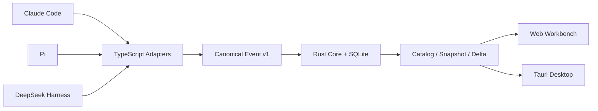

# Orchetrace

Orchetrace 是一个本地优先的多 Agent 可观测工作台，统一展示 Claude Code、Pi 和 DeepSeek Harness 的会话、父子 Agent 拓扑、工具调用、状态证据与执行时间线。

它不是 Agent 编排器，也不替代各运行时自己的交互界面。Orchetrace 只观察运行时已经产生的事实，并将它们转换为一致、可回放的诊断视图。

> 当前状态：`0.1.0-alpha`。核心链路已经可运行，适合本地试用和 Adapter 开发；安装包、数据保留策略和多版本兼容仍在加固中。

## 核心能力

- Claude Code、Pi、DeepSeek Harness 统一接入；
- 根 Agent、子 Agent 和嵌套子 Agent 拓扑；
- Replay 与 Live 两种观察模式；
- Agent 状态、activation、工具调用、错误和终态证据；
- 多 Run Catalog、搜索、状态过滤、Inspector 和 Timeline；
- Rust 确定性 fold、SQLite 事实存储、增量快照和 delta；
- WebSocket 实时通知，断开后自动降级为轮询；
- Tauri 桌面壳、受管 `otrace` sidecar 和运行时诊断抽屉；
- token 认证、loopback-only 监听和认证后的优雅退出。

## 运行时支持

| 运行时 | Replay | Live | 子 Agent |
|---|---|---|---|
| DeepSeek Harness | Fixture / persistence | Cordis Observer | 原生 session 与 descriptor |
| Claude Code | JSONL transcript | 增量 polling observer | subagent 与 workflow 文件 |
| Pi | v1-v3 session JSONL | 受管 RPC bridge | 显式 telemetry extension |

Pi 的普通对话分支不会被误判为子 Agent。只有 extension 提供显式 telemetry 时，Orchetrace 才展示 Pi 子 Agent 拓扑。

## 工作方式



统一协议只保存运行时能够证明的事实。`idle`、文件静默或普通工具名称不会被推断为 `done` 或子 Agent。

## 环境要求

- Rust 1.88 或更新版本；
- Node.js 22 或更新版本；
- macOS、Linux 或 Windows；
- 启动桌面壳时需要本机已安装 Tauri 2 对应的系统依赖。

仓库中的 TypeScript 直接使用 Node.js type stripping 运行，不需要额外 bundler。

## 快速开始

生成演示数据并启动 Web 工作台：

```bash
npm run fixture:demo

cargo run -q -p orchetrace-cli -- \
  fold fixtures/dsh/demo-canonical-events.jsonl \
  --data-dir apps/web/public/data

npm run dev:web
```

然后访问 <http://127.0.0.1:4173>。

## 启动本地 Live 服务

```bash
export ORCHETRACE_TOKEN="$(openssl rand -hex 32)"

cargo run -q -p orchetrace-cli -- \
  serve \
  --listen 127.0.0.1:43117 \
  --live-listen 127.0.0.1:43118 \
  --web-origin http://127.0.0.1:4173 \
  --db .orchetrace/orchetrace.db \
  --data-dir apps/web/public/data

npm run dev:web
```

Ingest 和 Live 端口只允许绑定 loopback 地址。Adapter 必须在首帧提供正确 token，WebSocket 还会校验 Origin。

## 接入 Claude Code

Replay 一个 Claude transcript：

```bash
npm run claude:map -- /path/to/session.jsonl \
  --source-id my-workspace \
  --output /tmp/claude-events.jsonl

cargo run -q -p orchetrace-cli -- \
  fold /tmp/claude-events.jsonl \
  --data-dir /tmp/orchetrace-claude
```

在 `otrace serve` 已运行且使用相同 token 时启动 Live Observer：

```bash
npm run claude:live -- /path/to/session.jsonl \
  --source-id my-workspace \
  --state .orchetrace/claude.cursor.json
```

Adapter 会自动发现相邻的 `subagents` 和 `workflows`，并在 Rust ACK 后才提交读取 cursor。

## 接入 Pi

Replay 一个 Pi session：

```bash
npm run pi:map -- /path/to/pi-session.jsonl \
  --source-id my-workspace \
  --output /tmp/pi-events.jsonl
```

启动受管 RPC Live Bridge：

```bash
npm run pi:live -- /path/to/pi-session.jsonl \
  --source-id my-workspace \
  --state .orchetrace/pi.live.json \
  --forward-stdin
```

如需展示 extension 创建的子 Agent，加载显式 telemetry contract：

```bash
npm run pi:live -- /path/to/pi-session.jsonl \
  --pi-extension ./packages/pi-telemetry-extension/src/index.ts
```

默认 RPC 命令为 `pi --mode rpc --session <path>`。

## 接入 DeepSeek Harness

在 Harness 插件配置中加载 `@orchetrace/dsh-observer`，并让 Observer 与 `otrace serve` 使用同一个 token：

```yaml
- name: "@orchetrace/dsh-observer"
  config:
    host: 127.0.0.1
    port: 43117
    sourceId: my-workspace
```

token 可以通过插件的 `config.token` 提供，也可以从 `ORCHETRACE_TOKEN` 环境变量读取。Observer 会组合实时事件与可用的冷 session persistence，并在断线后重发未确认事件。

## 桌面开发

```bash
# 校验静态前端与 Tauri Rust 壳
npm run desktop:check

# 构建 otrace sidecar 并启动桌面窗口
npm run desktop:dev
```

桌面端可以固定参数启动和停止受管 sidecar。token 只通过子进程环境传递，不出现在命令行；停止时优先执行认证后的协议级关闭，超时后才强制终止。

## 验证

```bash
# TypeScript Adapter 与 Web 测试
npm run check

# Rust workspace
cargo test --workspace --offline
cargo clippy --workspace --all-targets --offline -- -D warnings
cargo fmt --all -- --check

# 100k 合成事件性能基线
scripts/benchmark-100k.sh --output /tmp/orchetrace-benchmark-100k.json
```

当前测试集覆盖 Adapter 映射、断线重放、cursor 恢复、乱序 fold、SQLite 检查点、delta 合并、Web/Desktop bridge 和真实 sidecar 生命周期。

## 仓库结构

```text
crates/                       Rust protocol、core、ingest、storage 和 CLI
packages/                     TypeScript runtime adapters 与共享协议
apps/web/                     Web 工作台
apps/desktop/                 Tauri 2 桌面壳
schemas/                      Canonical Event JSON Schema
fixtures/                     已脱敏的跨运行时回放样本
scripts/                      开发、smoke 和性能脚本
```

## 安全与隐私

- 默认只监听 `127.0.0.1`；
- transcript 和工具内容不上传到远程服务；
- Live token 为每次启动生成的临时值；
- `live-config.json` 在 Unix 上使用 `0600` 权限；
- 数据库、游标、token 配置和本地设计资料均被 Git 忽略。

当前 Alpha 尚未实现完整的字段遮蔽、内容 blob、级联删除和数据保留策略。在这些能力完成前，请不要将未审查的敏感 transcript 或数据库提交到代码仓库。

## 当前限制

- Claude Live 仍使用 polling，大型 transcript 尚未使用 byte-range parser cache；
- Pi catch-up 尚未直接映射 RPC `entries`；
- DeepSeek Harness 需要补充更多真实 Loader 版本组合测试；
- Tauri bundle、代码签名、自动更新与跨平台安装验证尚未完成；
- Orchetrace 仍是工作名称，公开发行前需要完成包名和商标检查。

## License

[MIT](LICENSE)
