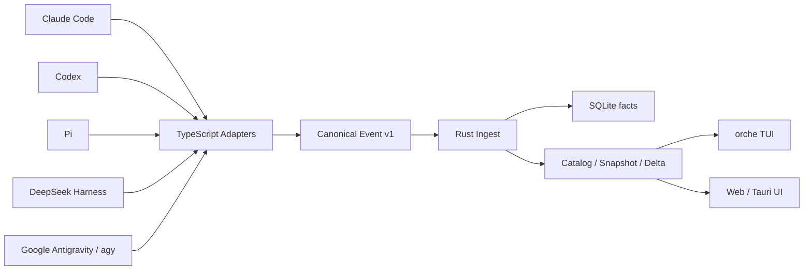
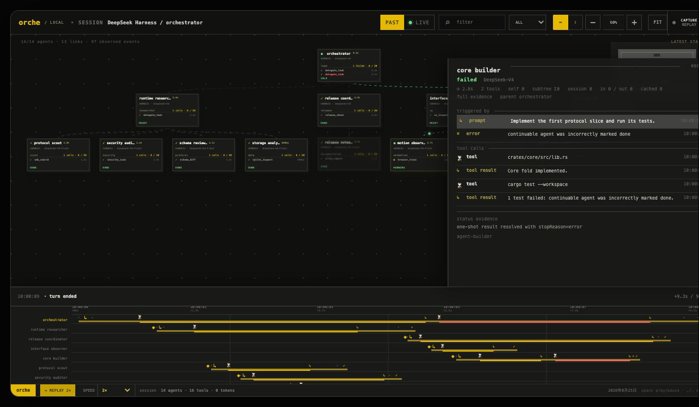

# Orchetrace Wiki

> 面向 Claude Code、Codex、Pi、DeepSeek Harness 和 Google Antigravity（`agy`）的本地优先多 Agent 可观测工作台。

Orchetrace 收集 Agent Runtime 已经产生的事实，将不同供应商的会话、父子 Agent、工具调用、运行状态和终态证据转换为统一的时间线与拓扑图。所有核心数据默认保留在本机。

Orchetrace 不是 Agent 编排器，不会代替 Runtime 终端，也不会为了画出完整流程而猜测子 Agent 或执行结果。

**当前版本：** `0.1.0-beta candidate`

## 目录

- [核心概念](#核心概念)
- [运行时支持](#运行时支持)
- [安装](#安装)
- [快速开始](#快速开始)
- [终端 TUI](#终端-tui)
- [Web 与桌面端](#web-与桌面端)
- [实时监测](#实时监测)
- [时间回放与详情](#时间回放与详情)
- [数据存储与安全](#数据存储与安全)
- [诊断修复与导出](#诊断修复与导出)
- [开发与扩展](#开发与扩展)
- [常见问题](#常见问题)
- [发布路线](#发布路线)

## 核心概念

### Canonical Event

每个 Adapter 都将 Runtime 原始记录转换为 `Canonical Event v1`。它统一表示：

- Session 发现与元数据变化；
- Agent 出生、激活、状态、终态和销毁；
- prompt、turn、step 和 context compaction；
- 工具开始、进度和结束；
- assistant message、reasoning summary 和错误证据。

协议区分 **活动状态** 和 **终态结果**。`idle` 只表示 Agent 当前没有活动，不等于 `succeeded`。只有 Runtime 提供显式结果和证据时，界面才会展示 done、failed 或 interrupted。

### Run

Run 是以根 Session 为边界的一次 Agent 执行。同一 Run 可包含多层子 Agent、多种工具和任意数量的时间线事件。

### Replay 与 Live

- **Replay**：从已持久化事件中重放。拖动时间轴时，拓扑和详情只显示当时已经发生的事实。
- **Live**：Adapter 持续读取 Runtime 记录，Rust Ingest 确认写入后才提交 Adapter cursor。

### 系统数据流



## 运行时支持

| Runtime | Replay 来源 | Live 方式 | 子 Agent 证据 |
|---|---|---|---|
| Claude Code | JSONL transcript | 自动发现 + 增量 polling | `subagents` 和 `workflows` |
| Codex | rollout JSONL | 递归发现 + ACK cursor | `thread_spawn.parent_thread_id` |
| Pi | v1-v3 session JSONL | 被动 watcher + 可选 RPC Bridge | 显式 telemetry extension |
| DeepSeek Harness | Zstandard persistence | 被动 watcher + Cordis Observer | session parent 和 descriptor |
| Google Antigravity (`agy`) | `transcript.jsonl` | 自动发现 + 350 ms 增量 watcher + 可选 Hooks | `invoke_subagent` conversation ID |

Pi 的普通对话分支不会被当成子 Agent。如果 Pi extension 没有发送 Orchetrace telemetry，界面不会仅根据工具名称猜测拓扑。

### 上游格式兼容矩阵

| Runtime | 已验证格式版本 | 版本依据 |
|---|---|---|
| Claude Code | transcript JSONL、生命周期 Hooks | 未声明版本，按 fixture 观测 |
| Codex | rollout JSONL | 未声明版本，按 fixture 观测 |
| Pi | session JSONL v1-v3、telemetry v1、RPC line JSON | 声明版本 + fixture 观测 |
| DeepSeek Harness | observer source JSONL、session persistence v1 | 声明版本 + fixture 观测 |
| Google Antigravity | brain transcript JSONL、named Hooks | 未声明版本，按 fixture 观测 |

“已验证”只覆盖仓库中脱敏 fixture 所代表的字段组合，不把上游未声明版本的格式描述成稳定 API。机器可读来源是 [`runtimes/compatibility.json`](../runtimes/compatibility.json)，其中列出每种格式的 raw fixture、Canonical fixture、测试、未知记录策略和已知限制。`npm run compatibility:check` 会验证 Runtime Registry 覆盖完整、证据文件可访问、Canonical Event runtime/schema 一致以及测试脚本存在；它已经进入 `npm run check` 和 CI。

## 安装

M7 提供 npm、Homebrew Formula 和 Homebrew Cask 三条 Beta 分发路径。相关包发布后可以执行：

```bash
# 终端 CLI、原生 orche/otrace 和五套 Runtime Adapter
npm install -g @orchetrace/cli@beta

# Homebrew 终端版
brew install wang-zhengxin/tap/orchetrace

# macOS 桌面版
brew install --cask wang-zhengxin/tap/orchetrace
```

npm 主包要求 Node.js 22，通过当前平台的 optional dependency 安装 Rust 二进制。Homebrew Formula 依赖 `node@22`，Cask 安装带内置 Node.js 和 Adapter 的桌面 DMG。npm 与 Formula 都会设置可搬迁的 Adapter 根目录和 `otrace` 解压路径，不依赖 Git checkout、编译时源码目录或系统 `zstd`。

当前只发布 Beta 通道：npm 使用 `beta` dist-tag，Homebrew 使用项目 Tap，不进入 npm `latest` 或 Homebrew/core。首次发布前需要由维护者创建 npm `@orchetrace` scope、`wang-zhengxin/homebrew-tap` 仓库和相应发布凭据。

### Release Preview

在创建标签前，可以手动运行完整预发布演练：

```bash
gh workflow run release.yml -f version=0.1.0-beta.4
```

Preview 与标签发布共享四平台构建、安装器内容/启动、历史版本回滚和 Homebrew 生命周期门禁，但不创建 Git 标签、GitHub Release，不发布 npm，也不修改 Tap。完成后产生保留 14 天的 `release-candidate-<run-id>` artifact，其中包含安装器、CLI/npm 包、Formula/Cask，以及机器可读 JSON 和 Markdown SHA-256 摘要。只有 `v*` 标签触发才允许进入外部发布步骤。

四平台 Release job 会在隔离前缀真实执行 npm CLI 的完整生命周期：安装基线版本、升级候选版本、回滚基线版本、卸载，并逐阶段检查 npm 命令 shim、主包/平台包版本、`orche --help` 和 `otrace`。本机已有 CLI 不会被覆盖。源码构建完 CLI bundle 后可手工运行：

```bash
node scripts/smoke-install-lifecycle.mjs \
  --target aarch64-apple-darwin \
  --bundle dist/cli/aarch64-apple-darwin/orchetrace \
  --version 0.1.0-beta.4
```

Tauri 构建之后，Release job 还会在对应操作系统原生解包 DMG、DEB 或 MSI，检查桌面主程序、Node.js 22、`otrace`、五套 Adapter 和 macOS 代码签名，并输出安装器 SHA-256。随后从最终安装器启动桌面主程序，使用 `ORCHETRACE_APP_DATA_DIR`、`ORCHETRACE_DATA_DIR`、XDG 与 WebView2 临时目录隔离测试数据，设置 `ORCHETRACE_AUTOSTART=0`；Linux 通过临时 Xvfb 显示环境运行。确认桌面事件循环稳定后会回收整个进程组并删除临时安装。已验证的安装器通过 Actions artifact 传给后续任务，不依赖草稿 Release 的下载权限。

标签发布还会在全新 macOS runner 上对生成的 Formula 和 Cask 执行 `brew style` 与实体生命周期。Formula 使用同一候选 CLI 归档生成基线/候选版本定义，真实执行安装、`brew upgrade`、回滚重装、`orche`/`otrace` 启动和卸载；Cask 自动下载最近公开 Release 的真实 DMG，在临时 Applications 和共享隔离数据目录中执行上一版安装、候选升级、上一版回滚与桌面启动。通过该门禁后才允许更新项目 Tap。

`v0.1.0-beta.3` 尚未发布 CLI 归档，因此 Formula 当前验证的是 Homebrew 版本事务而非两个历史二进制。等首个包含 CLI 归档的 Release 发布后，可把 Formula 基线自动切换为真实历史资产；Cask 从当前阶段起已经使用真实历史 DMG。

桌面跨版本任务会从 GitHub Releases 自动选择当前标签之前、含目标架构安装器的最新非草稿版本。四个平台分别在同一隔离 HOME/App Data 中执行“上一版 → 当前候选版 → 上一版”启动序列，并校验升级、回滚过程没有删除共享数据。首发没有历史安装器时会生成明确的跳过标记；从第二个兼容 Release 开始，该门禁是强制的。

## 快速开始

### 环境要求

- npm 安装需要 Node.js 22；
- 源码开发需要 Node.js 22、Rust 1.88 或更新版本；
- 仅从源码单独运行 DeepSeek Harness Adapter 时需要 `zstd` 命令；
- 桌面开发需要 Tauri 2 对应的系统依赖。

### 运行演示

```bash
git clone https://github.com/wang-zhengxin/orchetrace.git
cd orchetrace

npm run fixture:demo

cargo run -q -p orchetrace-cli --bin otrace -- \
  fold fixtures/dsh/demo-canonical-events.jsonl \
  --data-dir apps/web/public/data

npm run dev:web
```

打开 <http://127.0.0.1:4173>。演示数据包含多层 Agent、成功和失败工具、终态证据以及真实时间轴。

### 演示媒体

[](../demo/orchetrace-demo.mp4?raw=1)

- [播放或下载 18 秒 MP4 演示](../demo/orchetrace-demo.mp4?raw=1)；
- [查看轻量 GIF 回放](../demo/orchetrace-replay-keyframes.gif)。

两份媒体来自同一次确定性回放，覆盖 Agent 按事件时间出现、多行时间泳道、`1×` 到 `2×` 动态调速、失败节点证据侧栏，以及横向/纵向布局切换。它们展示的是脱敏 fixture，不包含本机真实 Session 内容。

## 终端 TUI

在项目中启动：

```bash
npm run tui
```

完整的全局安装建议使用 npm 或 Homebrew。从源码开发时也可以安装 Rust 命令：

```bash
cargo install --path crates/cli --bins
orche
```

`orche` 默认启动本地 Ingest，并被动观察已打开以及之后新建的五种 Runtime 会话。只查看已有投影时使用：

```bash
orche --replay
orche --data-dir /path/to/orchetrace/data
```

### TUI 快捷键

| 按键 | 操作 |
|---|---|
| `↑` / `↓` 或 `j` / `k` | 选择 Agent |
| `Enter` | 打开或关闭右侧详情 |
| `←` / `→` 或 `h` / `l` | 移动真实时间游标 |
| `Space` | 按当前倍率播放或暂停 |
| `,` / `.` | 在 `0.25×` 到 `8×` 的预设之间降速或加速 |
| `Tab` / `Shift+Tab` 或 `[` / `]` | 切换 Session |
| `f` | 返回并跟随最新状态 |
| `e` | 重命名当前 Session |
| `d` | 删除当前 Session 及全部子 Agent，确认后执行 |
| `q` | 退出 |

右上角缩略图与当前时间游标同步；底部时间轴按 Agent 分行，节点只在对应时间之后出现。每个节点显示 Runtime 实际上报的 Self Token 和包含后代 Agent 的 `Σ Subtree` Token；详情区分 Self、Subtree、Session，并拆分 input、output、cached input 和 cache write。Session 总量只求和 Self，避免重复计费。鼠标位于详情侧栏时滚轮滚动详情，位于拓扑区域时只切换当前 Session 内的 Agent；缺少 usage 事实时显示 `0 tok`，不做估算。超过 1,000 条的 Timeline 首屏使用概览，打开详情、回放或回溯时按需读取完整分页，Token 历史查询使用累计索引。

重命名会保留 Runtime、source 和原始 Session ID，仅记录一条本地 `session.metadata_changed`。删除由受 token 认证的本机 Ingest 执行，会级联删除后代 Agent 并同步重建 Catalog、Snapshot 和时间轴。活动 Runtime 如果继续写入，watcher 可能再次发现已删除的 Session；永久清理前应先结束对应 Agent。
桌面端还会在 Session 选择器内提供 `RENAME` / `DELETE`；两个操作都经过 Tauri 命令转发到受认证的本机 Ingest，普通 Web 模式不获取控制 token，也不启用破坏性按钮。
删除最后一个 Session 后，TUI、Web 与 Tauri 会显示 `WAITING FOR SESSION`，但不会退出 Live 监听；新的 Agent 会话被 watcher 发现后，Catalog、拓扑和时间轴会自动恢复。
Web/Tauri 底部时间轴提供 `0.25×` / `0.5×` / `1×` / `2×` / `4×` / `8×` 倍率选择，也可使用 `,` / `.` 切换；播放过程中改速会从当前游标继续。

## Web 与桌面端

Web 工作台包含：

- 横向或纵向 Agent 拓扑；
- 搜索、状态过滤、缩放和自适应；
- 多 Run Catalog；
- 拓扑缩略图；
- 多行时间轴和历史回放；
- 从右侧弹出的 Agent 详情；
- Runtime Diagnostics 抽屉。

桌面开发模式：

```bash
npm run desktop:check
npm run desktop:dev
```

Tauri 负责本地权限边界、`otrace` sidecar 生命周期、Runtime watcher 和受控文件读取。WebView 不能传入任意命令或任意文件路径。

Runtime Diagnostics 会将进程和 Adapter 状态聚合为：

- `healthy`：运行中且没有诊断；
- `warning`：运行中，存在可恢复警告；
- `degraded`：运行中，已记录错误；
- `error`：进程异常退出；
- `unavailable`：依赖或 sidecar 不可用。

诊断记录包含 severity、code、location 和 message，可用于定位哪个会话文件、RPC 记录或传输端点发生问题。

抽屉中的 `Storage Doctor` 是按需执行的只读检查，展示 Canonical Event 数量、Schema、checkpoint 和问题数量，并列出最多四条关键诊断。只有检查结果属于可修复的派生状态且 Ingest 已停止时，`ARM REPAIR` 才会启用；五秒内再次确认后只重建 checkpoint 与投影，不改写 Canonical Event。`EXPORT RUN` 将当前 Run 导出到应用数据目录的 `exports/`，自动生成不覆盖的 JSONL 文件名并在界面显示完整路径。

## 实时监测

### 手动启动 Ingest

```bash
export ORCHETRACE_TOKEN="$(openssl rand -hex 32)"

cargo run -q -p orchetrace-cli --bin otrace -- \
  serve \
  --listen 127.0.0.1:43117 \
  --live-listen 127.0.0.1:43118 \
  --web-origin http://127.0.0.1:4173 \
  --db .orchetrace/orchetrace.db \
  --data-dir apps/web/public/data
```

Ingest 和 WebSocket 只允许绑定 loopback。Adapter 首帧必须提供相同 token，WebSocket 还会检查 Origin。

### Claude Code

```bash
export ORCHETRACE_TOKEN="<ingest token>"
npm run claude:auto
```

默认监听 `~/.claude/projects`。对于早于 Orchetrace 打开的 Claude 终端，可安装用户级 Hook：

```bash
npm run claude:hook -- install
npm run claude:hook -- status
npm run claude:hook -- uninstall
```

Hook 只登记生命周期身份，不保存 prompt 或回答正文。

### Codex

```bash
export ORCHETRACE_TOKEN="<ingest token>"
npm run codex:auto
```

默认递归监听 `~/.codex/sessions/**/rollout-*.jsonl`。Adapter 按字节增量读取，并在 Rust ACK 后提交本地 cursor。

### Pi

```bash
export ORCHETRACE_TOKEN="<ingest token>"
npm run pi:auto
```

默认监听 `~/.pi/agent/sessions`。需要完整 RPC 生命周期时：

```bash
npm run pi:live -- /path/to/pi-session.jsonl \
  --source-id my-workspace \
  --state .orchetrace/pi.live.json \
  --forward-stdin
```

需要显示 extension 创建的子 Agent 时，加载显式 telemetry contract：

```bash
npm run pi:live -- /path/to/pi-session.jsonl \
  --pi-extension ./packages/pi-telemetry-extension/src/index.ts
```

### DeepSeek Harness

```bash
export ORCHETRACE_TOKEN="<ingest token>"
npm run dsh:auto
```

默认监听 `~/.dsh/sessions/**/session.jsonl.zstd`。需要落盘前的瞬时 status/disposed 事件时，在 Harness 插件配置中加载 `@orchetrace/dsh-observer`：

```yaml
- name: "@orchetrace/dsh-observer"
  config:
    host: 127.0.0.1
    port: 43117
    sourceId: dsh-local
```

### Google Antigravity（agy）

```bash
export ORCHETRACE_TOKEN="<ingest token>"
npm run antigravity:auto
```

默认发现 `~/.gemini/antigravity-cli/brain/<conversationId>/.system_generated/logs/transcript.jsonl`，1 秒内附着新会话，附着后每 350 ms 按字节读取新增完整行。读取游标只有在 Rust ACK 后才提交，因此重启不会丢事件，会话结束后也会保留在 Run Catalog 中。

需要立即接管较早打开的会话时，可显式安装 Hook：

```bash
orche hooks antigravity install
orche hooks agy status
orche hooks antigravity uninstall
```

Orchetrace 只在 `~/.gemini/config/hooks.json` 中维护 `orchetrace-observer` 这一项。Hook 邮箱不保存 prompt、回答和工具参数，正文由 transcript watcher 唯一映射，避免重复事件。默认 `orche` 不修改用户 Hook 配置。

### 自动发现策略

五个被动 watcher 默认接管最近 6 小时活跃的会话。导入全部历史时追加：

```bash
npm run codex:auto -- --include-existing
```

其他 Runtime 的 auto 命令同样支持 `--include-existing`。

## 时间回放与详情

时间轴使用事件的真实发生时间，不是演示动画。当游标移动到某个时间点时：

- 尚未出生的 Agent 不显示；
- 正在进行的工具不会提前显示未来结果；
- 终态和 outcome evidence 只在对应事件发生后出现；
- 拓扑缩略图和主视图保持一致。

Web/Tauri 可在播放过程中选择 `0.25×`、`0.5×`、`1×`、`2×`、`4×` 或 `8×`；切换倍率不会重置当前游标。节点集合按当前历史时刻重新计算并在可用画布内居中，横向与纵向布局共用相同的父子关系。

单击 Agent 节点可查看：

- prompt excerpt；
- reasoning summary；
- assistant message；
- activation 起止时间；
- tool input/output summary、耗时和结果；
- Agent Self Token、包含后代的 `Σ Subtree` Token、Session 总量及 input/output/cache 明细；
- terminal outcome 与证据。

超过 1,000 条的 Timeline 会分页持久化。首屏只读取概览，回放和详情按需加载历史页。

## 数据存储与安全

### 存储分层

- SQLite `canonical_events`：不可变的事实主表；
- SQLite checkpoint：可从事实重建的派生状态；
- Catalog/Snapshot/Delta：Web 和 TUI 读取的投影；
- Adapter cursor：只在 Ingest ACK 后提交的读取高水位。

### 隐私模式

`standard` 保留摘要和工具证据，但递归遮蔽常见 token、password、authorization、cookie 和 private key 字段。

`metadata-only` 保留拓扑、状态、模型、工具名、耗时和终态，但将 prompt、message、reasoning、arguments、路径和证据正文替换为 `[OMITTED]`。

```bash
export ORCHETRACE_PRIVACY_MODE=metadata-only
export ORCHETRACE_REDACT_KEYS=customer_id,workspace_id
export ORCHETRACE_RETENTION_DAYS=30
export ORCHETRACE_MAX_EVENTS=100000
orche
```

### 已有数据清理

以下是离线维护命令，操作前先停止 Ingest；实时运行时优先使用 TUI 的 `e` / `d`。

```bash
# 将已有事件改写为仅元数据
otrace scrub \
  --db /path/to/orchetrace.db \
  --data-dir /path/to/data \
  --privacy-mode metadata-only

# 删除 Session 及全部后代 Agent
otrace delete-session \
  --db /path/to/orchetrace.db \
  --data-dir /path/to/data \
  --runtime claude-code \
  --source-id my-workspace \
  --session-id session-id

# 按完整 Run 执行保留策略
otrace prune \
  --db /path/to/orchetrace.db \
  --data-dir /path/to/data \
  --older-than-days 30 \
  --max-events 100000
```

## 诊断修复与导出

### 数据库体检

```bash
otrace doctor --db /path/to/orchetrace.db
otrace doctor --db /path/to/orchetrace.db --json
```

`doctor` 检查：

- SQLite integrity；
- 外键违规；
- Canonical Event JSON 及协议校验；
- SQLite 索引列与 payload 是否一致；
- checkpoint 是否缺失、过期或损坏。

### 安全修复

```bash
otrace repair \
  --db /path/to/orchetrace.db \
  --data-dir /path/to/data
```

`repair` 只重建 checkpoint 和 Web/TUI 投影，不改写 Canonical Event。如果事实 JSON、索引列或 SQLite integrity 存在错误，命令会拒绝修复。

### 导出

```bash
# 全库
otrace export \
  --db /path/to/orchetrace.db \
  --output events.jsonl

# 单个 Run
otrace export \
  --db /path/to/orchetrace.db \
  --run-id '<catalog run_id>' \
  --output run.jsonl
```

导出文件使用已存储的隐私级别，可能包含 prompt 和工具证据。Unix 上文件权限默认为 `0600`。

### 支持诊断包

```bash
otrace diagnostics \
  --db /path/to/orchetrace.db \
  --output diagnostics.json
```

诊断包不包含 prompt、message、tool payload、token、Session ID 或本地路径。它只保留版本、存储健康、问题代码计数、Runtime 计数和匿名 Run 统计，适合附加到 Issue。

## 开发与扩展

### 项目结构

```text
crates/                       Rust protocol、core、ingest、storage 和 CLI
packages/                     TypeScript Runtime Adapters 与共享 SDK
runtimes/                     Runtime Registry
apps/web/                     Web 工作台
apps/desktop/                 Tauri 桌面壳
schemas/                      Canonical Event JSON Schema
fixtures/                     不可逆脱敏的回放样本
scripts/                      开发、测试和性能脚本
```

### 运行验证

```bash
npm run check
npm run desktop:prepare
cargo fmt --all -- --check
cargo clippy --workspace --all-targets --locked -- -D warnings
cargo test --workspace --locked
npm run desktop:check
```

100k 事件与 Adapter tail 性能基线：

```bash
scripts/benchmark-100k.sh --output /tmp/orchetrace-benchmark-100k.json
npm run benchmark:adapter-tail
```

### 扩展 Runtime

Runtime 清单的唯一来源是 `runtimes/registry.json`。修改后运行：

```bash
npm run runtime:generate
npm run runtime:check
npm run compatibility:check
```

Adapter 使用 `@orchetrace/adapter-runtime` 定义：

```ts
export const adapter = defineAdapter({
  protocolVersion: 1,
  runtime: "my-runtime",
  descriptor,
  create: (sink, options) => new MyPassiveObserver(sink, options),
});
```

Observer 需要实现 `start()`、`scanOnce()` 和 `stop()`。事件必须使用稳定唯一的 `event_id`，序列不能在同一 source/session/source-kind 内回退，并且只能在 Rust ACK 后提交持久化 cursor。

新 Adapter 至少需要：

1. 脱敏原始 fixture 和 Canonical fixture；
2. Mapper 测试；
3. Replay、增量读取、截断和重启测试；
4. 五运行时共享生命周期契约；
5. `runtimes/compatibility.json` 中对应的格式版本、证据和降级策略。
6. Rust fold/projection 测试；
7. 未知 required event 的显式 diagnostic。

## 常见问题

### 界面没有出现当前 Agent

1. 打开 Runtime Diagnostics，确认 Ingest 和相应 watcher 是 `healthy` 或 `warning`；
2. 确认 Runtime 会话目录没有被自定义配置移动；
3. 对于早已打开的 Claude 终端，安装 Hook 并再发送一次 prompt；
4. 会话早于默认 6 小时活跃窗口时，使用 `--include-existing`；
5. 检查诊断的 code 和 location。

### Pi 对话已显示，但没有子 Agent

这通常是预期行为。Pi Core 没有统一子 Agent 生命周期 API。需要 Pi extension 发送 Orchetrace telemetry，否则 Orchetrace 不会根据工具名猜测子 Agent。

### DeepSeek Harness watcher 不可用

先执行：

```bash
zstd --version
```

从源码单独运行被动 persistence watcher 时需要本机 `zstd` CLI。npm、Homebrew 和桌面安装包使用随包提供的 `otrace` 处理多帧 Zstandard。Cordis Observer 可提供实时状态，但不代替冷数据回放。

### 数据库可读，但界面投影不完整

```bash
otrace doctor --db /path/to/orchetrace.db
otrace repair --db /path/to/orchetrace.db --data-dir /path/to/data
```

如果 `doctor` 报告 Canonical Event 或 SQLite integrity 错误，不要手工删行或强制修复。先备份 `.db`、`.db-wal` 和 `.db-shm`，然后附加不含正文的诊断包报告 Issue。

### Web 处于 Replay，没有实时刷新

确认 `live-config.json` 由当前 Ingest 生成，Web Origin 与 `--web-origin` 一致，以及 `43118` 未被其他进程占用。WebSocket 断开时前端会退化为轮询，不会丢失已持久化事件。

### 时间轴事件很密集

概览层会压缩密集 marker，但保留失败和关键终态。选择 Agent 或打开详情后会按需加载完整分页 Timeline。

## 发布路线

### 已完成

- Runtime Registry 和外部 Adapter 扩展机制；
- Claude、Codex、Pi、DeepSeek Harness、Antigravity Adapter；
- Rust Core、SQLite、checkpoint、delta 和 Timeline 分页；
- Web、Tauri Alpha 和终端 TUI；
- 子 Agent 拓扑、真实时间回放和侧边详情；
- 隐私、保留、删除、体检、修复和导出；
- 五运行时生命周期契约与结构化诊断；
- Tauri release bundle、内置 `otrace`/Node.js/Adapter 资源与四平台 GitHub 构建矩阵；
- 安装包资源清单、Node.js 许可文件和自动化发布前校验；
- macOS ARM/Intel、Linux x64、Windows x64 可搬迁 CLI archive 与 SHA-256；
- npm 主包、平台原生包、离线安装烟测和 provenance 发布流程；
- Homebrew Formula/Cask 生成、官方样式校验和 Tap 自动更新流程。
- TUI、Web、Tauri 删除最后一个 Session 后的统一空态与自动恢复生命周期。
- 桌面 Runtime Diagnostics 的只读 Storage Doctor 与数据库健康摘要。
- 固定数据库边界、两步确认、Ingest 停止门禁的桌面 repair，以及当前 Run 安全导出。
- 上游 Runtime 机器可读兼容矩阵、五 Runtime fixture 证据闭环和 CI 发布门禁。
- macOS ARM/Intel、Linux x64、Windows x64 的 npm CLI 安装、升级、回滚和卸载门禁。
- DMG、DEB、MSI 最终内容、内置运行时、五 Adapter 与 macOS 签名门禁。
- DMG、DEB、MSI 临时展开、隔离数据启动、进程回收与卸载无残留烟测。
- Homebrew Formula/Cask 官方样式、实体安装、升级、回滚、命令或桌面启动与卸载门禁。
- 四平台最近 Release → 当前候选 → 最近 Release 的升级、回滚和共享数据保留门禁。
- 不创建 Release、不发布外部包的四平台 Release Preview 与候选产物 SHA-256 汇总。

### Beta 前待完成

- Developer ID 与 Windows 证书签名、macOS notarization；
- 首个 CLI 归档发布后的 Formula 历史二进制升级、回滚测试；
- 自动更新通道与签名密钥轮换流程；
- 创建并授权 npm `@orchetrace` scope 与 `wang-zhengxin/homebrew-tap`；
- 公开发布前的名称、包名和商标检查。

## 参与贡献

项目处于 Beta 候选阶段。贡献新 Runtime 映射时，请提供 Runtime 证据、不可逆脱敏 fixture、断线恢复说明和对应测试。

- 源代码：<https://github.com/wang-zhengxin/orchetrace>
- Issue：<https://github.com/wang-zhengxin/orchetrace/issues>
- 贡献指南：[CONTRIBUTING.md](https://github.com/wang-zhengxin/orchetrace/blob/main/CONTRIBUTING.md)
- 安全报告：[SECURITY.md](https://github.com/wang-zhengxin/orchetrace/blob/main/SECURITY.md)
